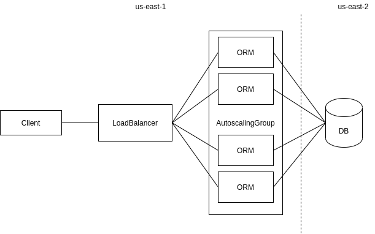

# Cloud Computing 2020.2 - Multicloud Project



- [x] Database: AWS's us-east-2 
- [x] ORM app
- [x] ORM served with AutoScaling Group and LoadBalancer
- [x] Simple CLI to interact with the app

#### To use the cli:

- ```./pellizzon --help```

Packages needed to run this project:
- ```pip3 install -U click requests python-dotenv boto3```
